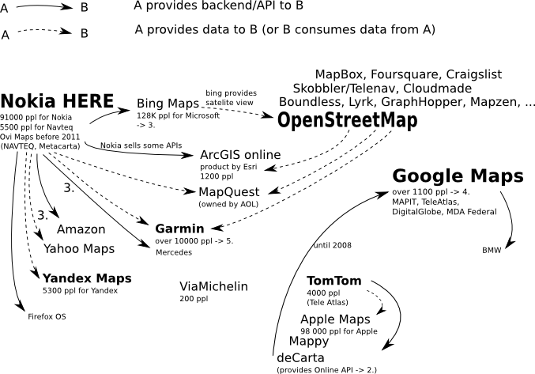

# The Map Companies Map

Overview gathered mainly from Wikipedia and Interweb

Included if the company

 * collects map data OR
 * provides known Online Maps OR
 * provides map services such as online/offline routing, geocoding or map tiles

(these requirements are subject to change)

## Contribute

Create an issue if you see mistakes or have additional information.
Or even better provide a pull request with a new inkscape vector svg!

## Sources

 1. http://en.wikipedia.org/wiki/Comparison_of_web_map_services
 2. http://searchengineland.com/tomtom-decarta-join-forces-take-google-maps-206543
 3. http://en.wikipedia.org/wiki/Here_%28Nokia%29
 4. http://www.businessinsider.com/apple-has-7000-fewer-people-working-on-maps-than-google-2012-9
 5. http://www.macroaxis.com/invest/ratio/GRMN--Number-of-Employees